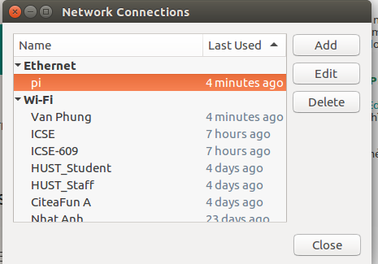
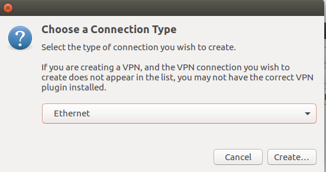
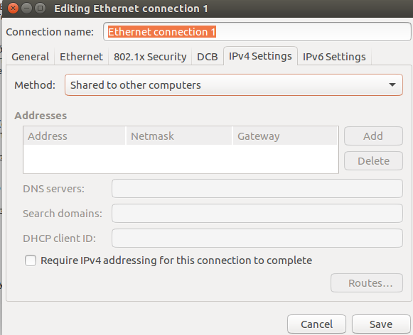
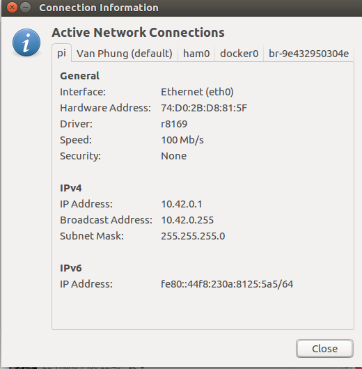
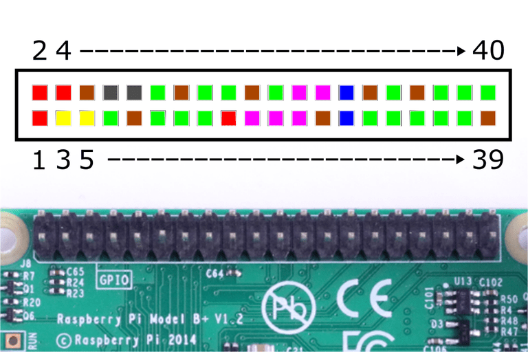
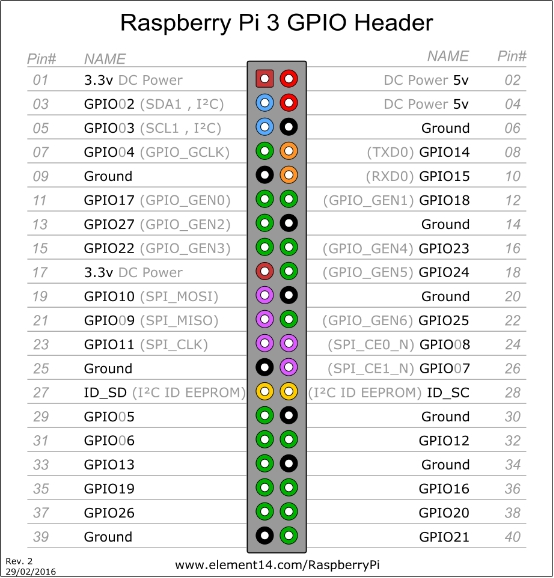
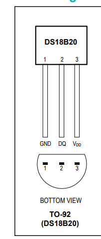
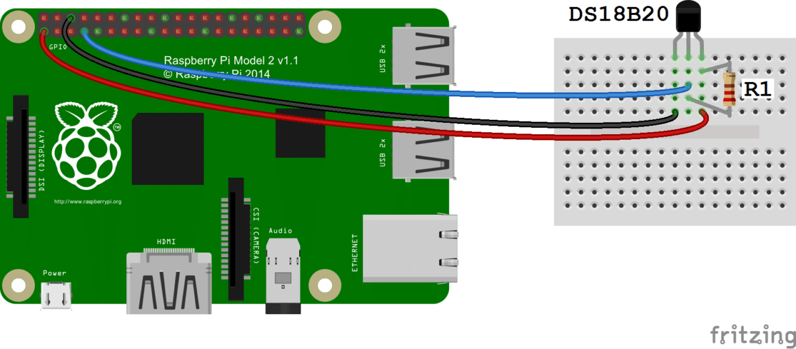
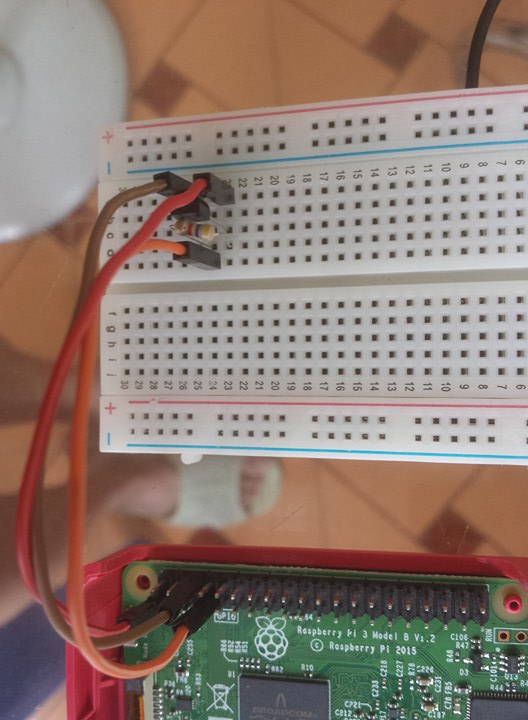
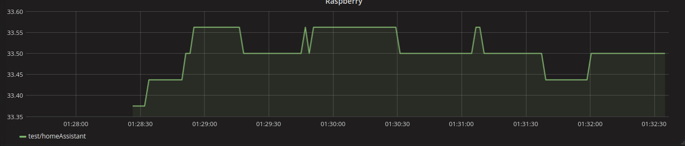

# Raspberry Pi 3

## Cài đặt Raspbian 

Chuẩn bị một thẻ SD và đầu đọc thẻ nhớ để cài đặt. 

Tải `Raspbian` từ địa chỉ https://www.raspberrypi.org/downloads/raspbian/ . Trong đây có: RASPBIAN JESSIE WITH DESKTOP và RASPBIAN JESSIE LITE. Ta chọn RASPBIAN JESSIE WITH DESKTOP để cài đặt ( có thể sử dụng được giao diện nếu muốn ) 

Sau khi tải xong RASPBIAN về máy ta cắm thẻ nhớ vào đầu đọc thẻ và sử dụng `Etcher` ( hoặc phần mềm nào khác ) để Burn file images Raspbian vừa tải vào thẻ SD. Link download Etcher: https://etcher.io/ . Cái này chỉ cần vào chọn image và đợi kết quả. 

Nếu không muốn tải Etcher và đang ở trên Linux thì ta có thể sử dụng các câu lệnh:

- `df -h ` : để xem thiết bị đã mount trên máy và chú ý đến thẻ nhớ. Giả sử trường hợp của mình là `/dev/sdb`

- Vào thư mục đã giải nén image chạy lệnh: `sudo dd bs=4M if=file_image of=tên_vừa_có_ở_lệnh_trước conv=fsync`

- Đợi quá trình kế thúc và eject (unmount) thẻ nhớ trước khi rút ra khỏi máy 

## Cấu hình static IP và SSH 

### Các thiết lập của máy tính 

Trên máy Ubuntu, vào phần `Edit Connections...` (biểu tượng mạng góc phải phía trên màn hình ). Nó hiện như hình :

 

Chọn ấn vào phần `Ethernet` và chọn `Add`:

 

Chọn `Create...` . Cửa sổ tiếp theo hiện ra ta đặt tên cho kết nối tùy ý sau đó chọn `IPv4 Settings` và mục `Method` chọn `Shared to other computers` như trong hình: 

Ấn `Save`. Các bước trên để phục vụ cho việc khi ta sử dụng dây mạng nối từ máy tính sang Pi.

Giờ cắm thẻ vào khe trên Pi, cắm dây mạng từ Pi vào máy tính, cắm dây nguồn từ Pi vào ổ điện. Nếu kết nối vừa tạo hiện `connected` trên máy tính thì mạng ta vừa tạo đã thông. Nhưng ta chưa kết nối được đến Pi vì Pi chưa có IP.

Giờ ta sẽ tạo IP tĩnh cho nó. Khi connect thành công thì ta vào `Connection Information` vẫn ở góc phải phía trên màn hình máy tính. Chọn vào cái tên mạng mà chúng ta vừa tạo ở bước trước. Tên mạng đã tạo là `pi` nên nó sẽ như hình: 

Chú ý đến phần `IP Address` ở `IPv4` là `10.42.0.1` và `Subnet Mask` là `255.255.255.0`. Giờ thì rút nguồn Pi, rút mạng Pi, rút thẻ nhớ Pi. Cắm thẻ nhớ vào đầu đọc thẻ và cắm vào máy tính của ta. 

### Các thiết lập cho Pi 

Truy cập vào file `etc/dhcpcd.conf`.

~~~
sudo nano etc/dhcpcd.conf 
~~~

Sau khi vào được file ta thêm đoạn sau vào cuối file 

~~~

# Custom static IP address for eth0.
interface eth0
    static ip_address=10.42.0.11/24
    static routers=10.42.0.1
    static domain_name_servers=10.42.0.1

~~~

Địa chỉ `10.42.0.11` là địa chỉ IP mà mình sẽ đặt cho thằng Pi với subnet là `24` (do mạng vừa tạo là 255.255.255.0 ). Hai cái thông số còn lại trỏ  đến cái máy tính của mình. Rồi `Ctrl + X` để lưu lại. 

Xong bước trên là ta đã có IP tĩnh cho PI và giờ ta chuyển sang bước SSH .

Thiết lập IP là để ta SSH vào Pi nhưng không may thay thằng từ thằng Pi 3 trở đi SSH là mặc định nữa nên ta phải bật nó lên. Vào ổ `boot` ( nhớ là vẫn cắm thẻ nhớ vào máy tính của mình nhé chứ ko cắm Pi ) tạo một file `ssh`nhớ là file có tên là `ssh` và ko có phần mở rộng, trong file không cần có dữ liệu. Tạo file `ssh` xong ta có thể rút thẻ nhớ ra và cắm vào pi, cắm dây mạng từ pi vào máy tính, cắm điện từ pi vào ổ điện. 

Bật terminal máy tính lên: 
~~~
	sudo ssh pi@10.42.0.11
~~~

`10.42.0.11` là cái IP đã đặt cho Pi ở mấy bước trên. Tài khoản mặc định của Pi3 là : 
~~~
 user: pi
 password: raspberry 
~~~

## Thiết lập Wifi cho Pi 

Đầu tiên ta chạy lệnh `sudo nano /etc/wpa_supplicant/wpa_supplicant.conf` để thêm vào cuối file `wpa_supplicant.conf` thông tin của wifi dự định kết nối: 

~~~
network={
    ssid="tên_wifi "
    psk="password_wifi"
}
~~~

Tuy nhiên để bảo mật hơn ta nên sử dụng lệnh : ` wpa_passphrase tên_wifi password_wifi `. Lệnh này sẽ mã hóa password của wifi để bảo mật hơn. Ta được kết quả: 

~~~
network={
	ssid="tên_wifi"
	#psk="password_wifi"
	psk=78c597cdabe6262dfca88ddd0977c6df1906126af588b1a2362bfca290992892
}
~~~

Ta thêm kết quả trên vào file  `/etc/wpa_supplicant/wpa_supplicant.conf`. Chú ý xóa dòng ` #psk="password_wifi" `

Khởi động lại Pi bằng `sudo reboot` ta đã có thể kết nối tới wifi. Nhưng lúc này Pi đang sử dụng một định chỉ IP động dẫn đến nhiều trường hợp bất tiện (ví dụ khi muốn ssh). Nên ta sẽ đặt một địa chỉ IP tĩnh cho Pi khi sử dụng wifi. 

Sử dụng lệnh `sudo nano /etc/dhcpcd.conf` và thêm vào cuối file: 

~~~

# Custom static IP address for wlan0.
interface wlan0
    static ip_address=192.168.0.188/24
    static routers=192.168.0.1
    static domain_name_servers=192.168.0.1

~~~

Các thông số Subnet, routers, DNS xem tại `Connection Information` tương ứng với wifi. Sau đó ta khởi động lại Pi. Giờ ta có thể SSH tới Pi qua Wifi tại địa chỉ 192.160.0.188. 

## Cài đặt Sensor nhiệt độ DS18B20

Đầu tiên ta phải biết một số thông tin về `GPIO` của Raspberry Pi 3. Nó nôm na là 40 cái chân cắm thực hiện các chức năng khác nhau. Hình dưới đây là cách đánh số trên Pi3: 

Hình trên để ta biết rằng Pi3 đánh số theo chiều nào còn hình sau đây sẽ chi tiết hơn: 

Hiện tại ta chú ý đến 3 loại:

- Các chân nguồn: chân 3.3v là: 1, 17 còn chân 5v là: 2, 4

- Các chân nối đất (Ground hay nhiều cái kí hiệu là GND) : 6, 9, 14, 20, 25, 30, 34, 39 

- Các chân input, output dữ liệu: 7, 11, 12, 13, 15, 16, 18, 22, 29, 31, 32, 33, 35, 36, 37, 38, 40

- Các chân còn lại do chưa hiểu chức năng nên ta chưa trình bày tại đây

Để cài đặt sensor này ta cần: sensor DS18B20, Điện trở, dây cắm, bảng mạch

Hình trên thể hiện thứ tự các chân của sensor. `GND` là chân nối đất, `DQ` là chân dữ liệu, còn `Vdd` là chân cấp nguồn. Datasheet của DS18B20 [tại đây](https://datasheets.maximintegrated.com/en/ds/DS18B20.pdf) 

Mọi người có thể tham khảo hình:

Hoặc hình mình làm: 

Tóm lại là Vdd của sensor cắm vào chân 1 của Pi ( để cấp nguồn 3.3v) . Chân GND của sensor cắm vào chân thứ 6 của Pi. Còn chân DQ của sensor cắm vào chân 7 của Pi. Điện trở cắm vào 2 chân DQ và Vdd của sensor. 

Thế là ta đã xong phần cài đặt phần cứng. Giờ ta ssh vào Pi để khai báo driver cho việc load dữ liệu từ sensor vào thằng Pi. Sử dụng lệnh `sudo nano /boot/config.txt` và thêm đoạn mã sau vào cuối file:

~~~

# DS18B20
dtoverlay=w1-gpio

~~~

Sau đó ta chạy `sudo reboot` để khởi động lại Pi. Sau đó ssh lại và chạy `lsmod` nếu ra kết quả có đoạn sau thì tức là đã load được driver: 

~~~
Module                  Size  Used by

w1_therm                6401  0 
w1_gpio                 4818  0 
wire                   32619  2 w1_gpio,w1_therm
~~~

Để chắc chắn thì ta có thể vào đường dẫn 

~~~

pi@raspberrypi:~ $ ls /sys/bus/w1/devices
28-0516a1383dff  w1_bus_master1

~~~

Nếu thấy thư mục nào có địa chỉ 28-xxxxxxxx (28 kia là cái mã của thằng sensor DS18B20 còn cái xxxxxxx kia kiểu như id để xác định các sensor khi có nhiều sensor DS18B20 khác nhau) như trên hình tức là Pi đã nhận được sensor. Tiếp tục sử dụng câu lệnh sau để có thể xem được dữ liệu: 

~~~

pi@raspberrypi:~ $ cat /sys/bus/w1/devices/28-0516a1383dff/w1_slave 
0b 02 4b 46 7f ff 0c 10 5d : crc=5d YES
0b 02 4b 46 7f ff 0c 10 5d t=32687

~~~

`t=32687` thể hiện nhiệt độ đang là 32687/1000 = 32.687 độ C

Sử dụng đoạn code Python sau để hiển thị dữ liệu: 

~~~

import glob
import time
 
base_dir = '/sys/bus/w1/devices/'
device_folder = glob.glob(base_dir + '28*')[0]
device_file = device_folder + '/w1_slave'
 
def read_temp_raw():
    f = open(device_file, 'r')
    lines = f.readlines()
    f.close()
    return lines
 
def read_temp():
    lines = read_temp_raw()
    while lines[0].strip()[-3:] != 'YES':
        time.sleep(0.2)
        lines = read_temp_raw()
    equals_pos = lines[1].find('t=')
    if equals_pos != -1:
        temp_string = lines[1][equals_pos+2:]
        temp_c = float(temp_string) / 1000.0
        temp_f = temp_c * 9.0 / 5.0 + 32.0
        return temp_c, temp_f
	
while True:
	print(read_temp())	
	time.sleep(1)
	
~~~

## Demo hiển thị dữ liệu lên Grafana

Cài đặt Docker lên Raspberry Pi: `curl -sSL https://get.docker.com | sh` nếu không muốn sudo thì sau khi cài đặt xong chạy: `sudo usermod -aG docker pi` và `sudo reboot`

Ở lần Demo này ta sử dụng các image: mosquitto, home-assistant, grafana, influxdb 

**Chú ý:** : Các image mà mình thường cài trên máy thông thường sẽ không cài được trên Raspberry vì nó sử dụng kiến trúc ARM chứ không phải như x86_64 như các máy tính thông thường ( kinh nghiệm sau khi thấy các container lăn ra chết khi vừa run). Vì vậy khi tìm image mọi người nên tìm các image build trên arm hoặc nó chỉ rõ là cho Pi3. Sau đây là một số image đã chạy được: 

~~~
REPOSITORY                                 TAG                 IMAGE ID            CREATED             SIZE
homeassistant/raspberrypi3-homeassistant   latest              bf6886e10fe3        3 days ago          869MB
easypi/influxdb-arm                        latest              aa6415ff32b7        5 weeks ago         177MB
easypi/grafana-arm                         latest              d97a4fd1503c        5 weeks ago         247MB
easypi/mosquitto-arm                       latest              eee1bd81433d        2 months ago        6.7MB

~~~

Ta run các container Grafana, Influxdb, Mosquitto. Để đơn giản các container ta đều publish một cổng cho dễ cài đặt:

~~~

# Nhớ tạo một thư mục để làm volume cho influxdb như ở đây là: /home/pi/haiquan5396/influxdb_data

docker run --name influxdb -itd -p 8086:8086 -v /home/pi/haiquan5396/influxdb_data:/var/lib/influxdb easypi/influxdb-arm

docker run --name grafana -itd -p 3000:3000 easypi/grafana-arm

docker run --name mqtt -itd -p 1883:1883 easypi/mosquitto-arm

~~~

Tạo một file để lấy dữ liệu từ sensor và publish lên mqtt như sau:

~~~
import glob
import time
import paho.mqtt.client as mqtt  # import the client1

 
base_dir = '/sys/bus/w1/devices/'
device_folder = glob.glob(base_dir + '28*')[0]
device_file = device_folder + '/w1_slave'

broker_address = "10.42.0.11"

client = mqtt.Client("QuanPub")  # create new instance
client.connect(broker_address)  # connect to broker

def read_temp_raw():
    f = open(device_file, 'r')
    lines = f.readlines()
    f.close()
    return lines
 
def read_temp():
    lines = read_temp_raw()
    while lines[0].strip()[-3:] != 'YES':        
        time.sleep(0.2)
        lines = read_temp_raw()
    equals_pos = lines[1].find('t=')
    if equals_pos != -1:
        temp_string = lines[1][equals_pos+2:]
        temp_c = float(temp_string) / 1000.0
        return temp_c
while True:
        temp = read_temp()
	print(temp)
        client.publish("test/homeAssistant", temp)
	time.sleep(1)

~~~

Ta dùng python để chạy file vừa tạo. Tiếp theo, ể chạy Home-Assistant ta cần file cấu hình: 

- **configuration.yaml** giả sử lưu trong thư mục `/home/pi/haiquan5396/custom-ha`

~~~
homeassistant:
  # Name of the location where Home Assistant is running
  name: Home
  # Location required to calculate the time the sun rises and sets
  latitude: 10.8142
  longitude: 106.6438
  # Impacts weather/sunrise data (altitude above sea level in meters)
  elevation: 5
  # metric for Metric, imperial for Imperial
  unit_system: metric
  # Pick yours from here: http://en.wikipedia.org/wiki/List_of_tz_database_time_zones
  time_zone: Asia/Ho_Chi_Minh

# Show links to resources in log and frontend
introduction:

# Enables the frontendhttps://datasheets.maximintegrated.com/en/ds/DS18B20.pdf
frontend:

# Enables configuration UI
config:

http:
  # Uncomment this to add a password (recommended!)
  # api_password: PASSWORD
  # Uncomment this if you are using SSL or running in Docker etc
  # base_url: example.duckdns.org:8123

# Checks for available updates
# Note: This component will send some information about your system to
# the developers to assist with development of Home Assistant.
# For more information, please see:
# https://home-assistant.io/blog/2016/10/25/explaining-the-updater/
updater:
  # Optional, allows Home Assistant developers to focus on popular components.
  # include_used_components: true

# Discover some devices automatically
discovery:

# Allows you to issue voice commands from the frontend in enabled browsers
conversation:

# Enables support for tracking state changes over time.
history:

# View all events in a logbook
logbook:

quanhehe: 

mqtt:
  broker: 10.42.0.11

sensor:
  - platform: mqtt
    name: "test"
    state_topic: "test/homeAssistant"

automation:
  trigger:
    platform: mqtt
    topic: "test/homeAssistant"

  action:
    service: quanhehe.driverhehe

~~~

- **quanhehe.py** lưu trong thư mục `/home/pi/haiquan5396/custom-ha/custom_components` :

~~~

from influxdb import InfluxDBClient

DOMAIN = 'quanhehe'

def setup(hass, config):
    """Set up is called when Home Assistant is loading our component."""

#    client = InfluxDBClient("10.42.0.11", 8086, "root", "root", "_internal")
#    client.create_database("pi")
#    client.switch_database("pi")
    client = InfluxDBClient("10.42.0.11", 8086, "root", "root", "pi")
    client.create_database("pi")

    def handle_mess(call):
        state = hass.states.get('sensor.test')
        data = state.state

        json_body = [
            {
                "measurement": "test/homeAssistant",
                "fields": {
                    "value": float(data)
                }
            }
        ]

        client = InfluxDBClient("10.42.0.11", 8086, "root", "root", "pi")
        client.write_points(json_body)

    hass.services.register(DOMAIN, 'driverhehe', handle_mess)

    # Return boolean to indicate that initialization was successfully.
    return True

~~~

file `quanhehe.py` sẽ được home-Assistant load và khi Home-Assistant nhận được dữ liệu từ mqtt thì nó sẽ kích hoạt hàm `handle_mess(call)` đẩy dữ liệu vào database Influxdb. 

Chạy Home-Assistant: 

~~~

docker run --name home -dit -v /home/pi/haiquan5396/custom-ha:/config homeassistant/raspberrypi3-homeassistant

~~~

Bây giờ ta có thể vào `10.42.0.11:3000`để có thể cấu hình Grafana lấy dữ liệu từ Influxdb. Kết quả sẽ được như sau: 

## Tài liệu tham khảo 

- https://www.raspberrypi.org/documentation/installation/installing-images/linux.md

- https://www.lifewire.com/tour-of-the-raspberry-pi-gpio-4063016

- http://www.jumpnowtek.com/rpi/Using-DS18B20-1-wire-Temp-Sensors-with-the-Raspberry-Pi.html

- http://www.circuitbasics.com/raspberry-pi-ds18b20-temperature-sensor-tutorial/

- https://datasheets.maximintegrated.com/en/ds/DS18B20.pdf

